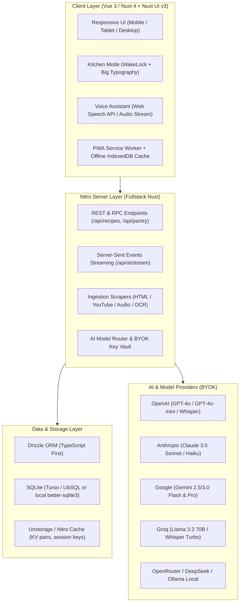

# Heirloom: Architecture & Full-Stack Tech Stack

## 1. System Architecture Overview

---

## 2. Core Frontend Stack (Nuxt & Vue Ecosystem)

### Framework: Nuxt 4 / Latest Nuxt 3
- **Engine:** Vue 3 Composition API with `<script setup lang="ts">`.
- **SSR / SSG / Hybrid:** Hybrid rendering. Universal SSR for fast initial loads, dynamic client-side SPA transitions for instant in-app navigation, and full offline fallback for active cooking sessions.
- **Routing:** File-based routing with typed pages and layout wrappers (`layouts/default.vue`, `layouts/kitchen.vue`).

### UI Component Framework: Nuxt UI v3
- Built on top of **Tailwind CSS v4** and modern headless accessible primitives (Radix Vue / Headless UI).
- Includes built-in dark/light mode toggle with smooth color-scheme transition.
- **Icons:** `@nuxt/icon` with Lucide icon set (cookware, timers, flame, nutrition icons).
- Custom design tokens for the **"Modern Heirloom"** theme:
  - Warm serif typography for titles (`Playfair Display`, `Lora`, or `Fraunces`).
  - Ultra-legible sans-serif for ingredient weights and steps (`Inter` or `Geist Sans`).
  - High-contrast kitchen mode palette (preventing washed-out text under harsh kitchen lighting).

### Client Utilities & Performance:
- **`@vueuse/core`:**
  - `useWakeLock`: Prevents the tablet/phone screen from dimming or turning off during active cooking.
  - `useSpeechRecognition` / `useSpeechSynthesis`: Hands-free vocal navigation ("Next step", "Repeat that", "Set a timer for 10 minutes").
  - `useLocalStorage` & `useSessionStorage`: Local key caching and persistent kitchen state.
- **`@vite-pwa/nuxt`:**
  - Full Progressive Web App (PWA) manifest and Service Worker caching.
  - Offline-first cache for saved recipes, ingredients, and instructions.

---

## 3. Fullstack Nitro Server Architecture

### Server Routes & Endpoints
- `/api/recipes` (`GET`, `POST`, `PUT`, `DELETE`): Full CRUD for recipes and revisions.
- `/api/ingest/url` (`POST`): Ingests and cleans recipe content from any URL (HTML/JSON-LD).
- `/api/ingest/video` (`POST`): Fetches video metadata and transcripts (YouTube/TikTok) for processing.
- `/api/ingest/image` (`POST`): Handles image uploads for handwritten card OCR and dish photos.
- `/api/ai/recipe/stream` (`POST`): Server-Sent Events (SSE) streaming endpoint providing real-time AI recipe generation and gap-filling feedback to the client.
- `/api/ai/substitute` (`POST`): Molecular and culinary substitution recommendations.
- `/api/meal-plan/orchestrate` (`POST`): Calculates multi-course synchronized timelines.

### Data Layer: Drizzle ORM + SQLite / LibSQL
- **Why Drizzle ORM:**
  - 100% type-safe SQL schema definitions.
  - Zero heavy runtime overhead compared to Prisma.
  - Seamless migration tooling (`drizzle-kit`).
- **Database Engine:**
  - **Primary:** SQLite via `@libsql/client` (Turso compatible) or `better-sqlite3`.
  - **Portability:** Can be run locally as a zero-dependency `.db` file or deployed to cloud edge nodes (Cloudflare D1, Turso, Fly.io, Vercel).
  - Can optionally adapt to PostgreSQL if multi-user team collaboration requires it.

---

## 4. Kitchen-Proof User Experience (Kitchen Mode)

Cooking in a real kitchen introduces unique physical challenges:
1. **Dirty / Wet Hands:** Users cannot pinch-to-zoom or fiddle with tiny pagination buttons.
2. **Distance Viewing:** The tablet or phone sits on a counter or magnetic fridge mount 1–2 meters away.
3. **Steam & Glare:** Sunlight or overhead spotlights can wash out low-contrast UI.

### Kitchen Mode Specifications:
- **Dedicated Layout (`layouts/kitchen.vue`):**
  - Ultra-large step numbering and headings (font-size: 2.25rem–3rem).
  - Single-step focused view with a progress bar and quick swipe / tap-anywhere navigation.
  - Built-in floating **Interactive Timers**: When a step mentions "simmer for 15 minutes", an interactive one-tap timer badge appears on the step. Multiple concurrent timers can run (e.g. "Pasta Boiling - 8m", "Garlic Roasting - 20m").
  - **Sensory Alert Cards:** Highlighted callouts for critical safety or doneness moments (e.g., "⚠️ Watch closely: Sugar goes from caramel to burnt in 30 seconds").
  - **Voice Commands:** Local browser speech recognition listening for wake triggers:
    - *"Next"* / *"Back"*
    - *"Read step"*
    - *"Timer 5 minutes"*
    - *"What's the temp?"*
