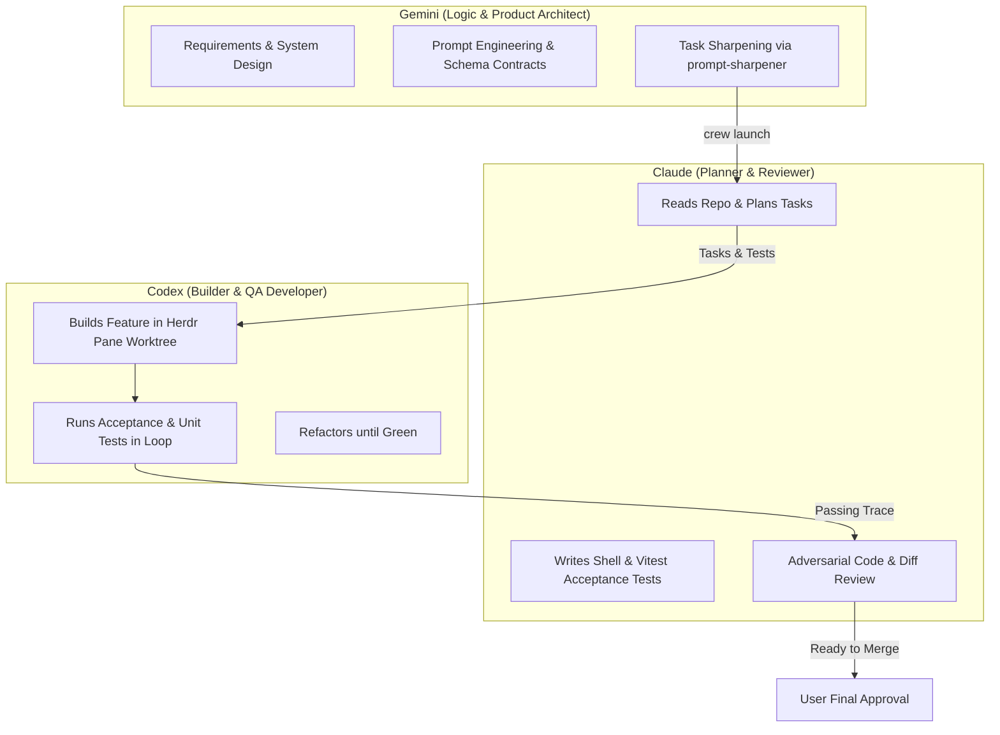

# Heirloom: Team Roles, Multi-Agent Workflow & MCP Ecosystem

## 1. The Autonomous Agent Trio

To build Heirloom with high velocity and zero regression, the development lifecycle is divided into three distinct roles across Gemini, Codex, and Claude.

### 1. Gemini (The Logic & System Architect)
- **Role:** Product Strategy, Domain Logic, Prompt Engineering, Specification & Orchestration.
- **Responsibilities:**
  - Break down high-level user vision into rigorous architectural blueprints.
  - Define Zod schema contracts and AI prompt templates.
  - Sharpen developer tasks into structured `crew launch` goals (`Goal / Context / Constraints / Done when`).
  - Coordinate the execution lifecycle without editing code directly.

### 2. Codex (The Developer & QA Engineer)
- **Role:** Implementation, Code Construction, Test Execution, and Bug Resolution.
- **Responsibilities:**
  - Operates inside isolated Git worktrees within Herdr multiplexed panes.
  - Implements Nuxt 4 pages, Nuxt UI components, Nitro API routes, and Drizzle database models.
  - Executes unit tests (Vitest) and integration tests to verify features empirically.
  - Loops on test failures (up to 3 strikes) to self-heal code before submitting diffs.

### 3. Claude (The Reviewer & Adversarial QA)
- **Role:** Task Planning, Acceptance Test Authoring, and Rigorous Code Review.
- **Responsibilities:**
  - Deconstructs `crew launch` goals into 1–8 discrete, testable sub-tasks.
  - Authors independent acceptance test scripts (`npm test`, curl checks, CLI assertions).
  - Performs adversarial code review on Codex's git diffs (checking for type leaks, security flaws, edge cases, responsive layout quirks).
  - Approves or sends rejection feedback back to Codex with specific line annotations.

---

## 2. MCP (Model Context Protocol) Ecosystem

The development environment and the running application will leverage specialized MCP servers:

| MCP Server | Usage in Development | Usage in Production / App |
| :--- | :--- | :--- |
| **`agent-core_context7`** | Instant, zero-hallucination lookup of latest Nuxt 4, Vue 3, Drizzle ORM, and Tailwind v4 documentation. | *N/A (Dev time only)* |
| **`agent-core_memory`** | Shared cross-agent memory graph (`~/.config/agents/memory/knowledge-graph.jsonl`) synchronizing architectural decisions between Gemini, Claude, and Codex. | Can store user culinary preferences & allergies. |
| **`playwright`** | Automated browser testing across mobile (390px), tablet (820px), and desktop (1440px) viewports to verify Kitchen Mode and tap targets. | *N/A (Dev / QA time)* |
| **`agent-core_fetch`** | Testing live URL scraping against complex food blogs to validate HTML cleaning and JSON-LD extraction. | Live web ingestion proxy. |
| **`chrome-devtools`** | Auditing Largest Contentful Paint (LCP), CPU performance, and memory consumption during active cooking sessions. | *N/A (Dev / QA time)* |

---

## 3. Recommended Plugins & Packages for Nuxt

- `@nuxt/ui`: Component primitives, icons, and Tailwind styling.
- `@nuxtjs/color-mode`: Flawless dark/light/heirloom theme toggling.
- `@vueuse/nuxt`: Composable hooks (`useWakeLock`, `useSpeechRecognition`, `useLocalStorage`).
- `drizzle-orm` + `drizzle-kit`: Database schema definitions and migrations.
- `zod`: End-to-end schema validation for API routes and AI completions.
- `@vite-pwa/nuxt`: Service worker management, offline asset caching, and mobile install prompt.
- `cheerio` & `@mozilla/readability`: High-efficiency server-side web content parsing.
- `canvas-confetti`: Delightful visual feedback when a cooking session is successfully completed.
